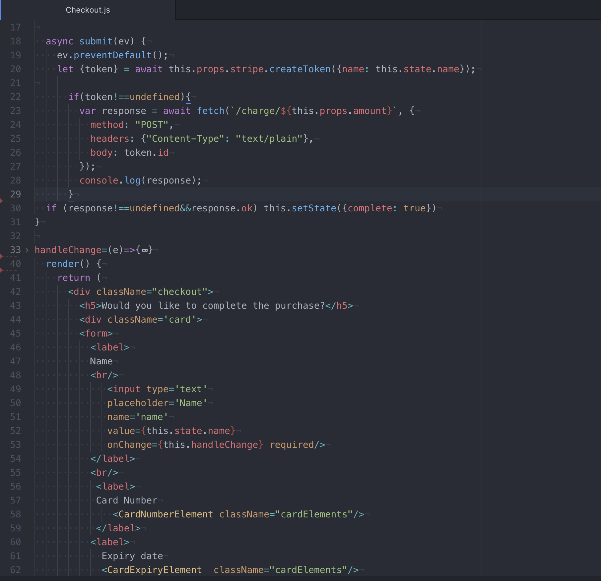

# Swarovski E Commerce

## Description
Swarovski E Commerce website built with Stripe API integration
Checkout slides in when selected. Notification if transaction was processed.
Different views for products offered.
Pure CSS, no frameworks used.

### E Commerce Checkout Code with Stripe

## Technology Used
1. Stripe Api on backend Express call
2. React frontend
3. Express backend

## Youtube video showcasing app
https://youtu.be/nopoMhfsrUI

### Instructions to use
1. Clone repo
2. NPM I on backend
3. NPM Start to run backend server
4. CD into client npm i
5. NPM Start to run react

